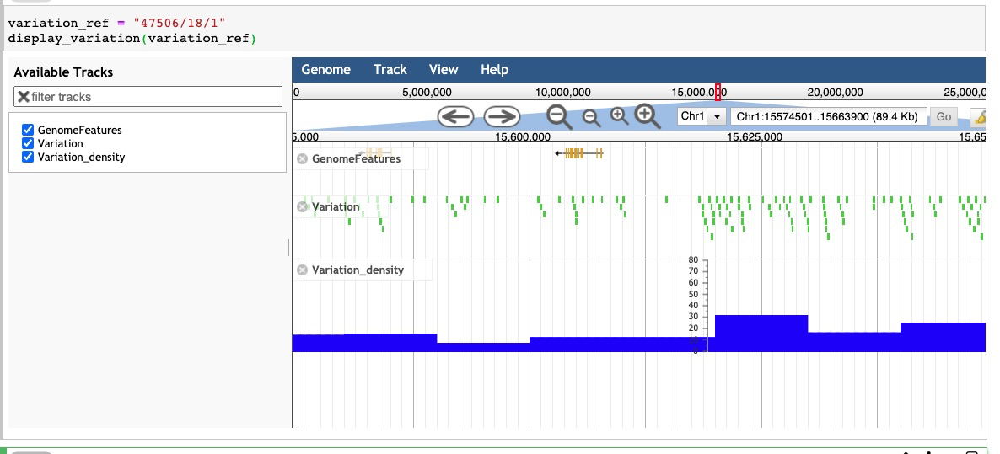

# Jbrowse based visualization of variation data

## To test locally
</br>

(copy .env.example to .env and update token and environment information in .env)
</br>
<code>cp .env.example  .env</code>
```
KBASE_ENDPOINT=https://appdev.kbase.us/services
token=DIBQOM62C4LBIPAJZEMG3C45ST4LP2TS
```

</br>
<code>docker-compose up</code>
</br>

## Run tests 

</br>
<code>docker-compose run web test </code>
</br>

## To test in narrative code cell

```python

def display_variation_in_jbrowse(variation_ref):
    '''
    '''
    import requests
    import json
    from IPython.display import IFrame
    
    config_env = os.environ['CONFIG_ENV']
    if (config_env=="prod"):
        service_wizard_url = "https://kbase.us/services/service_wizard"
    else:
        service_wizard_url = "https://" + config_env + ".kbase.us/services/service_wizard"
        json_obj = {
            "method": "ServiceWizard.get_service_status",
            "id": "",
            "params": [{"module_name": "JbrowseServer", "version": "dev"}]
        }
    
    sw_resp = requests.post(url=service_wizard_url, data=json.dumps(json_obj))
    ju = sw_resp.json()
    jbrowse_url = ju['result'][0]['url'] + "/jbrowse/" + variation_ref + "/index.html"
    return (IFrame(src=jbrowse_url, width=1200, height=400))
```


## Appdev variation reference "47506/18/1"
```python
variation_ref = "47506/18/1"
display_variation_in_jbrowse(variation_ref)
```


